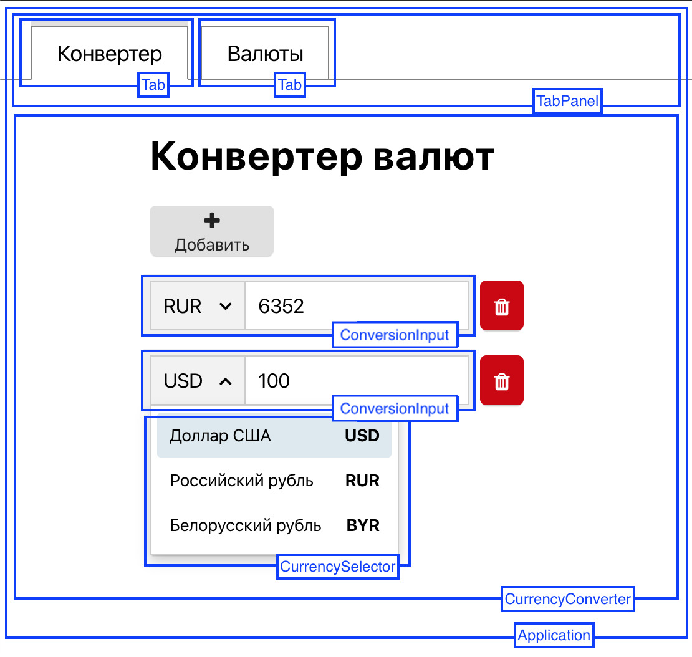
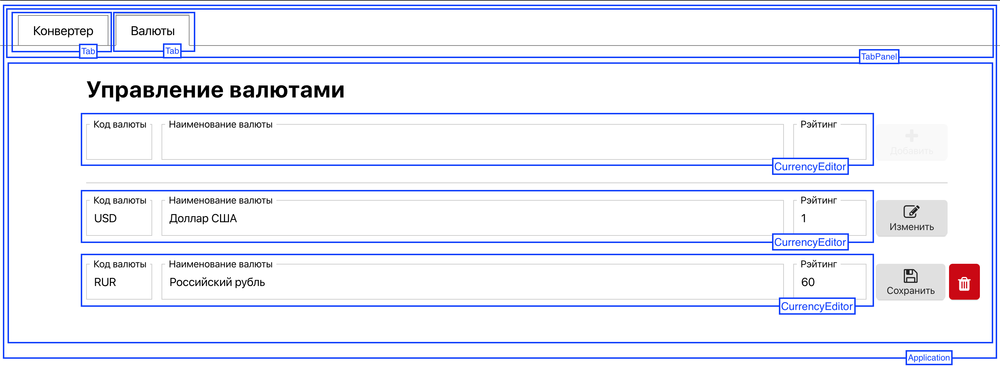

# Конвертер валют на AngularDart

Данный проект является учебно-демонстрационным. Он покрывает большую часть возможностей фреймворка AngularDart. То что не охвачено данным проектом легко можно взять из документации.

## Цели проекта:

- Демонстрация возможностей фреймворка AngularDart
- Демонстрация внутренней архитектуры проекта на AngularDart
- Демонстрация приемов декомпозиции приложения
- Формирование понимания составных частей приложения:
  - компоненты и шаблоны
  - директивы
  - маршрутизация
  - формы и валидация
  - генерация и обработка событий
- Демонстрация подключения бизнес логики к интерфейсу с использованием BLoC-паттерна (Business Logic Component)

## Благодарности

Я хочу выразить благодарность Роману Петрову за идею приложения, которая оказалась очень удачной в том смысле, что на примере реализации этой идеи получилось продемонстрировать большую часть возможностей AngularDart, включая те, которые не достаточно отражены в документации и ответах на StackOverflow. А также я благодарен ему за html-верстку и css, которые используются в приложении.

## Интерфейс приложения

Интерфейс состоит из двух разделов:

- собственно конвертера валют
- раздела управления валютами

Каждый из разделов расположен на соответствующей вкладке. Переключение вкладок производит переключение между разделами.

### Конвертер валют

Конвертер валют может содержать несколько конверсий, которые можно произвольно добавлять и удалять. Для каждой конверсии можно выбрать валюту и указать сумму. При изменении суммы в любой из конверсий автоматически пересчитываются суммы в остальных конверсиях в соответствии с выбранными валютами.

### Управление валютами

Данный раздел предназначен для управления списком известных конвертору валют. Интерфейс состоит из формы добавления новой валюты и списка валют, каждый элемент которого можно редактировать (изменить или удалить).

## Архитектура проекта

## Запуск приложения

1. Установить Dart, если он еще не установлен
2. Клонировать репозиторий
3. `cd /path/to/repository/angular`
4. `pub get`
5. `pub run webdev serve`
6. Открыть в браузере URL [http://localhost:8080](http://localhost:8080)

## Порядок изучения

1. [web/main.dart](web/main.dart)
2. [web/index.html](web/index.html)
3. [lib/src/routes/route_paths.dart](lib/src/routes/route_paths.dart)
4. [lib/src/routes/routes.dart](lib/src/routes/routes.dart)
5. [lib/src/components/application/application.dart](lib/src/components/application/application.dart)
6. [lib/src/components/application/application.html](lib/src/components/application/application.html)
7. [lib/src/components/tab_panel/tab_panel.dart](lib/src/components/tab_panel/tab_panel.dart)
8. [lib/src/components/tab_panel/tab_panel.html](lib/src/components/tab_panel/tab_panel.html)
9. [lib/src/components/tab/tab.dart](lib/src/components/tab/tab.dart)
10. [lib/src/components/tab/tab.html](lib/src/components/tab/tab.html)
11. [lib/src/components/currency_manager/currency_manager.dart](lib/src/components/currency_manager/currency_manager.dart)
12. [lib/src/components/currency_manager/currency_manager.html](lib/src/components/currency_manager/currency_manager.html)
13. [lib/src/components/currency_editor/currency_editor.dart](lib/src/components/currency_editor/currency_editor.dart)
14. [lib/src/components/currency_editor/currency_editor.html](lib/src/components/currency_editor/currency_editor.html)
15. [lib/src/validators/currency_code_validator.dart](lib/src/validators/currency_code_validator.dart)
16. [lib/src/validators/only_number_validator.dart](lib/src/validators/only_number_validator.dart)
17. [lib/src/components/labeled_input/labeled_input.dart](lib/src/components/labeled_input/labeled_input.dart)
18. [lib/src/components/labeled_input/labeled_input.html](lib/src/components/labeled_input/labeled_input.html)
19. [lib/src/components/labeled_input/labeled_input_default_value_accessor.dart](lib/src/components/labeled_input/labeled_input_default_value_accessor.dart)
20. [lib/src/components/labeled_input/handler_mixins.dart](lib/src/components/labeled_input/handler_mixins.dart)
21. [lib/src/components/labeled_input/labeled_input_uppercase_value_accessor.dart](lib/src/components/labeled_input/labeled_input_uppercase_value_accessor.dart)
22. [lib/src/components/labeled_input/labeled_input_number_value_accessor.dart](lib/src/components/labeled_input/labeled_input_number_value_accessor.dart)
23. [lib/src/components/currency_converter/currency_converter.dart](lib/src/components/currency_converter/currency_converter.dart)
24. [lib/src/components/currency_converter/currency_converter.html](lib/src/components/currency_converter/currency_converter.html)
25. [lib/src/components/conversion_input/conversion_input.dart](lib/src/components/conversion_input/conversion_input.dart)
26. [lib/src/components/conversion_input/conversion_input.html](lib/src/components/conversion_input/conversion_input.html)
27. [lib/src/services/local_currency_service.dart](lib/src/services/local_currency_service.dart)
