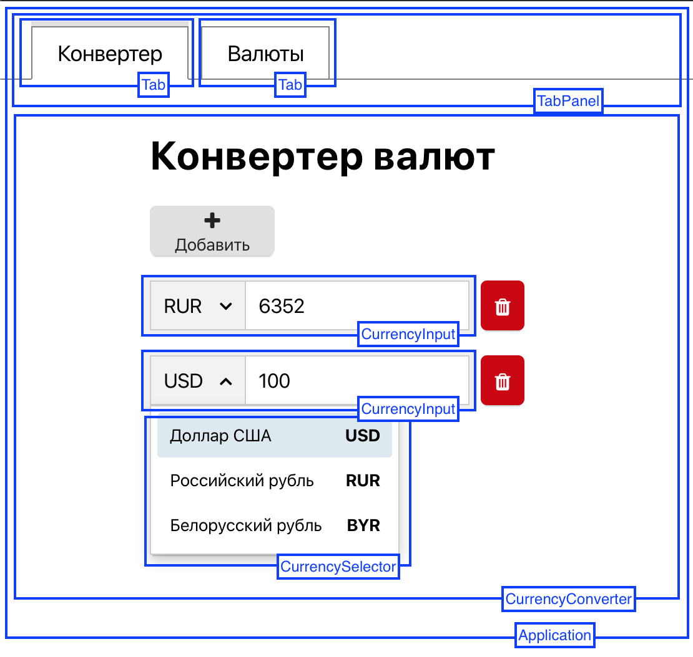
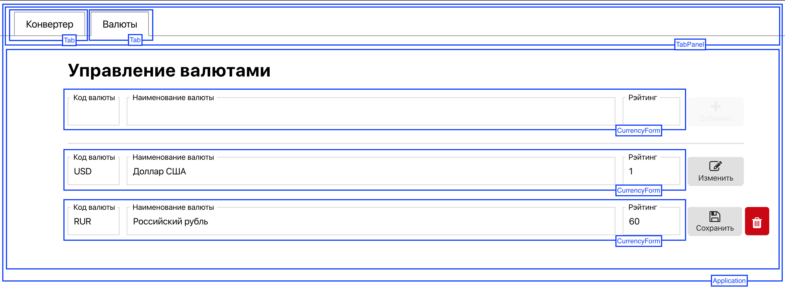

# Конвертер валют на AngularDart

Данный проект является учебно-демонстрационным. Он покрывает большую часть возможностей фреймворка AngularDart. То что не охвачено данным проектом легко можно взять из документации.

## Цели проекта:

- Демонстрация возможностей фреймворка AngularDart
- Демонстрация внутренней архитектуры проекта на AngularDart
- Демонстрация приемов декомпозиции приложения
- Формирование понимания составных частей приложения:
  - компоненты и шаблоны
  - директивы
  - маршрутизация
  - формы и валидация
  - генерация и обработка событий
- Демонстрация применения для реализации бизнез-логики компонентов бизнез-логики (BLoC - pattern).

## Благодарности

Я хочу выразить благодарность Роману Петрову за идею создания такого приложения, которая оказалась очень удачной в том смысле, что на примере реализации этой идеи получилось продемонстрировать большую часть возможностей AngularDart, включая те, которые не достаточно отражены в документации и ответах на StackOverflow. А также я благодарен ему за html-верстку и css, которые я у него честно украл.

## Интерфейс приложения

Интерфейс состоит из двух разделов:

- собственно конвертера валют
- раздела управления валютами

Каждый из разделов расположен на соответствующей вкладке. Переключение вкладок производит переключение между разделами.

### Конвертер валют

Конвертер валют может содержать несколько конверсий, которые можно произвольно добавлять и удалять. Для каждой конверсии можно выбрать валюту и указать сумму. При изменении суммы в любой из конверсий автоматически пересчитываются суммы в остальных конверсиях в соответствии с выбранными валютами.

### Управление валютами

Данный раздел предназначен для управления списком известных конвертору валют. Интерфейс состоит из формы добавления новой валюты и списка валют, каждый элемент которого можно редактировать (изменить или удалить).

## Архитектура проекта

