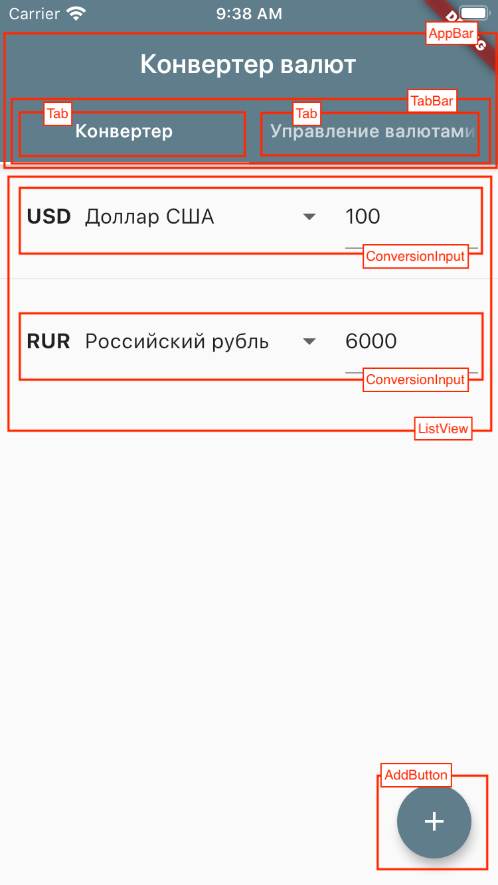
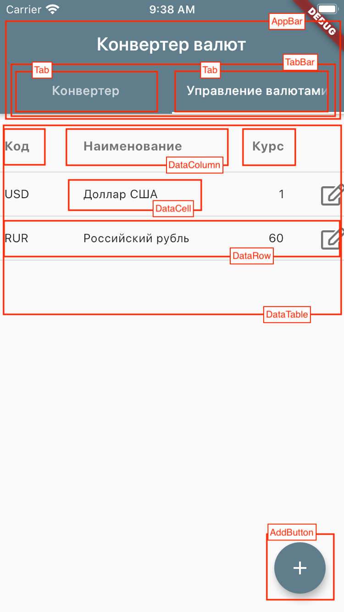
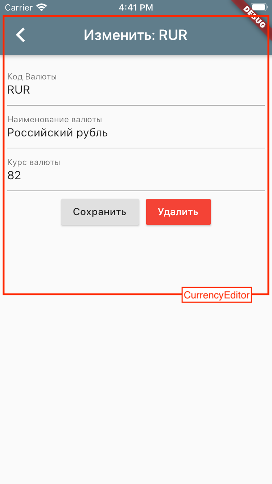

# Конвертер валют

Мобильная версия

## Цели проекта

- Демонстрация применения BLoC-паттерна в мобильном приложении на Flutter.
- Демонстрация возможностей использования общей кодовой базы в web- и мобильном приложениях.

## Дизайн интерфейса

На картинках ниже показано расположение компонентов приложения

## Запуск приложения

1. [Установить flutter](https://flutter.dev/docs/get-started/install)
2. Клонировать репозиторий
3. `cd /path/to/repository/flutter`
4. `flutter pub get`
5. Запустить эмулятор мобильного телефона. Это можно сделать прямо из `VSCode` или `Android Studio`
6. `flutter run`

## Порядок изучения

1. [lib/main.dart](lib/main.dart)
2. [lib/src/application.dart](lib/src/application.dart)
3. [lib/src/local_currency_service.dart](lib/src/local_currency_service.dart)
4. [lib/src/home_page.dart](lib/src/home_page.dart)
5. [lib/src/currency_manager.dart](lib/src/currency_manager.dart)
6. [lib/src/currency_editor.dart](lib/src/currency_editor.dart)
7. [lib/src/currency_converter.dart](lib/src/currency_converter.dart)
8. [lib/src/conversion_input.dart](lib/src/conversion_input.dart)
9. [lib/src/add_button.dart](lib/src/add_button.dart)
